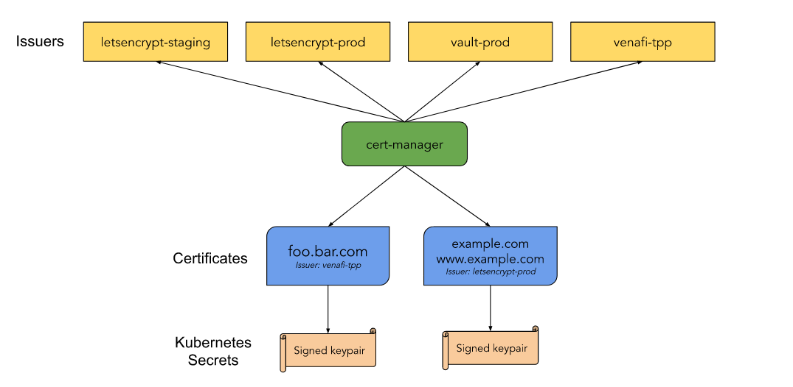

## 简介
cert-manager是本地Kubernetes证书管理控制器。它可以帮助从各种来源颁发证书，例如Let's Encrypt， HashiCorp Vault， Venafi，简单的签名密钥对或自签名。

它将确保证书有效并且是最新的，并在到期前尝试在配置的时间续订证书。


## 组件

* [Issuer](https://cert-manager.io/docs/concepts/issuer/) 
* [Certificate](https://cert-manager.io/docs/concepts/certificate/)
* [CertificateRequest](https://cert-manager.io/docs/concepts/certificaterequest/)
* [ACME Orders and Challenges](https://cert-manager.io/docs/concepts/acme-orders-challenges/)
* [Webhook](https://cert-manager.io/docs/concepts/webhook/)
* [CA Injector](https://cert-manager.io/docs/concepts/ca-injector/)

## 安装
创建 CRD
``` sh
# Kubernetes 1.15+
$ kubectl apply --validate=false -f https://github.com/jetstack/cert-manager/releases/download/v0.14.2/cert-manager.yaml

# Kubernetes <1.15
$ kubectl apply --validate=false -f https://github.com/jetstack/cert-manager/releases/download/v0.14.2/cert-manager-legacy.yaml
```
创建命名空间
```sh
kubectl create namespace cert-manager
```
增加 helm 仓库
```sh
helm repo add jetstack https://charts.jetstack.iov
helm repo update
```
使用 helm 安装 cert-manager
```sh
# Helm v3+
$ helm install \
  cert-manager jetstack/cert-manager \
  --namespace cert-manager \
  --version v0.14.2

# Helm v2
$ helm install \
  --name cert-manager \
  --namespace cert-manager \
  --version v0.14.2 \
  jetstack/cert-manager
```

## Example-Demo
步骤1，部署一个示例应用
```yaml
apiVersion: apps/v1
kind: Deployment
metadata:
  name: kuard
spec:
  selector:
    matchLabels:
      app: kuard
  replicas: 1
  template:
    metadata:
      labels:
        app: kuard
    spec:
      containers:
      - image: registry.cn-hangzhou.aliyuncs.com/rd-pubilc/kuard-amd64:1
        imagePullPolicy: Always
        name: kuard
        ports:
        - containerPort: 8080
---
apiVersion: v1
kind: Service
metadata:
  name: kuard
spec:
  ports:
  - port: 80
    targetPort: 8080
    protocol: TCP
  selector:
    app: kuard
```
```sh
kubectl apply -f deployment.yaml
```

步骤2，部署一个 ingress：
```yaml
apiVersion: extensions/v1beta1
kind: Ingress
metadata:
  name: kuard
  annotations:
    kubernetes.io/ingress.class: "nginx"    
    #cert-manager.io/issuer: "letsencrypt-staging"

spec:
  tls:
  - hosts:
    - example.oifipaas.com
    secretName: quickstart-example-tls
  rules:
  - host: example.oifipaas.com
    http:
      paths:
      - path: /
        backend:
          serviceName: kuard
          servicePort: 80
```
```sh 
kubectl apply -f ingress.yaml
```

测试检查：
```sh
curl -kivL -H 'Host: example.oifipaas.com' 'http://192.168.2.195'
```

步骤3， 配置 Let’s Encrypt Issuer
设置两个 issuer, staging-issuer 和 production-issuer, 邮箱要填写有效的地址，用于通知证书过期。

```yaml
apiVersion: cert-manager.io/v1alpha2
kind: Issuer
metadata:
 name: letsencrypt-staging
spec:
 acme:
   # The ACME server URL
   server: https://acme-staging-v02.api.letsencrypt.org/directory
   # Email address used for ACME registration
   email: fanchao@soundbus.cn
   # Name of a secret used to store the ACME account private key
   privateKeySecretRef:
     name: letsencrypt-staging
   # Enable the HTTP-01 challenge provider
   solvers:
   - http01:
       ingress:
         class:  nginx
```
```sh
kubectl apply -f staging-issuer.yaml
```

```yaml
apiVersion: cert-manager.io/v1alpha2
kind: Issuer
metadata:
 name: letsencrypt-prod
spec:
 acme:
   # The ACME server URL
   server: https://acme-staging-v02.api.letsencrypt.org/directory
   # Email address used for ACME registration
   email: fanchao@soundbus.cn
   # Name of a secret used to store the ACME account private key
   privateKeySecretRef:
     name: letsencrypt-pord
   # Enable the HTTP-01 challenge provider
   solvers:
   - http01:
       ingress:
         class:  nginx
```
```sh
kubectl apply -f production-issuer.yaml
```
两个issuer 使用 http 验证
```sh
kubectl describe issuer letsencrypt-staging
```

